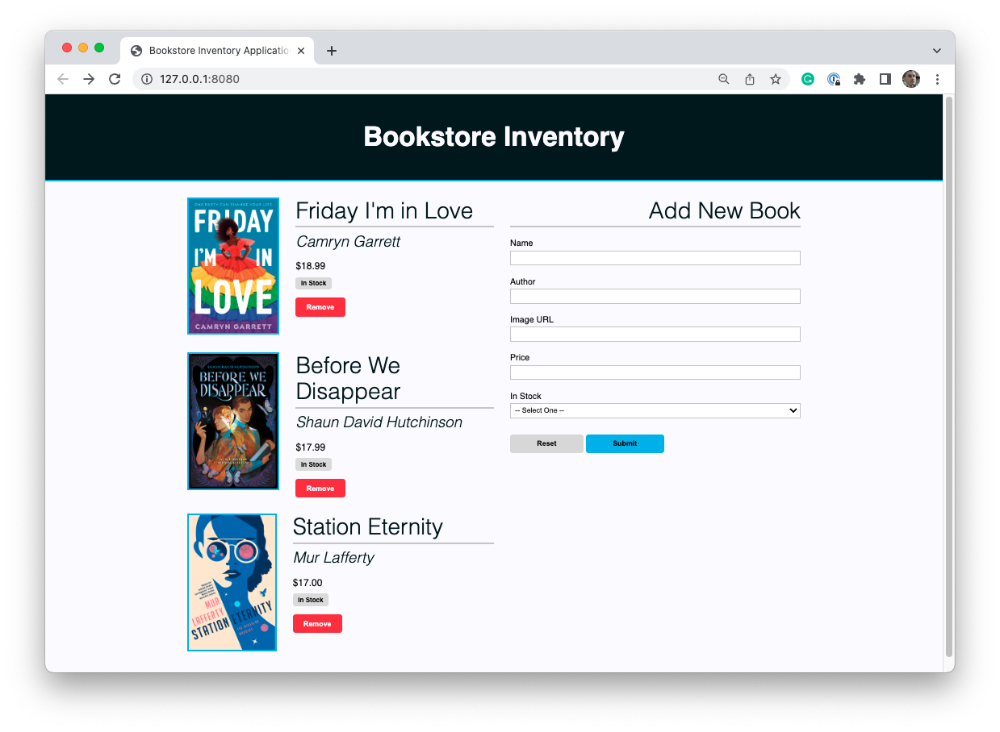
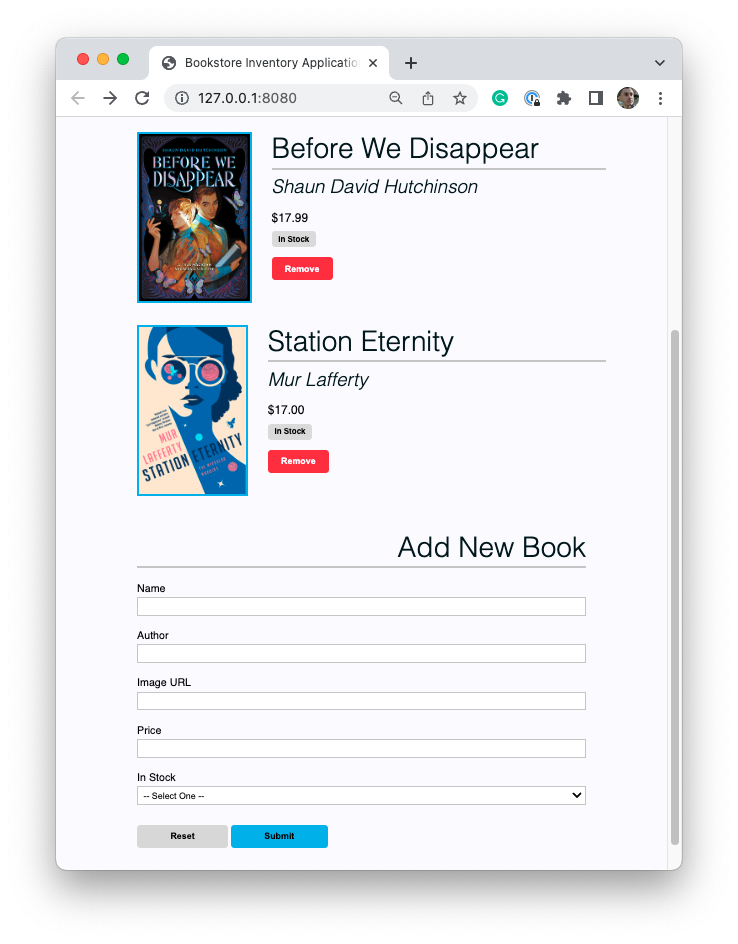
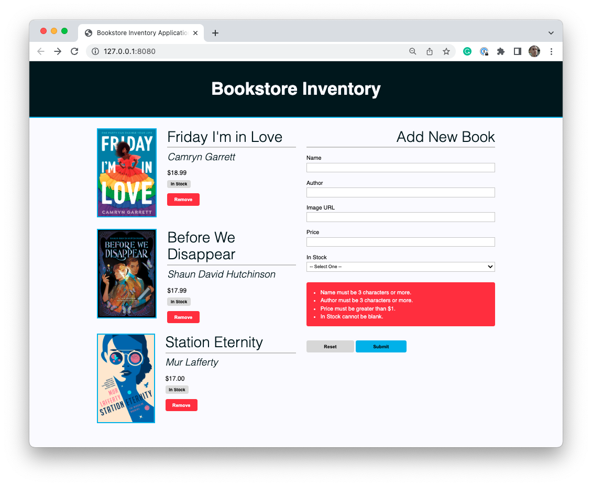
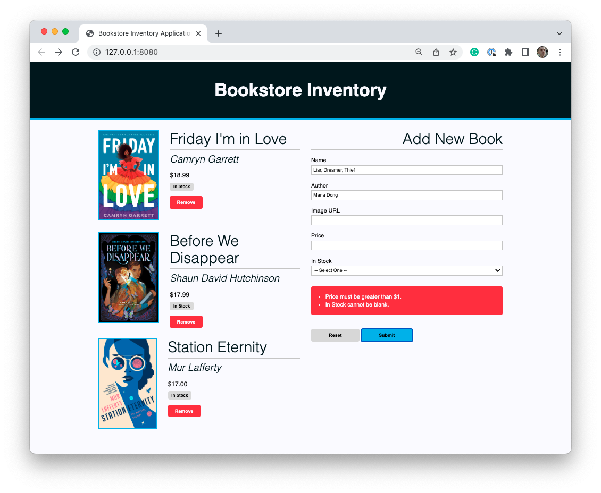
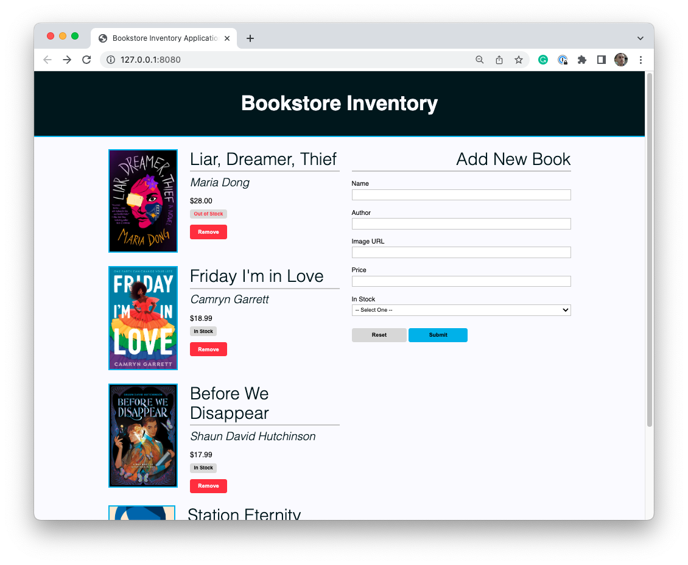
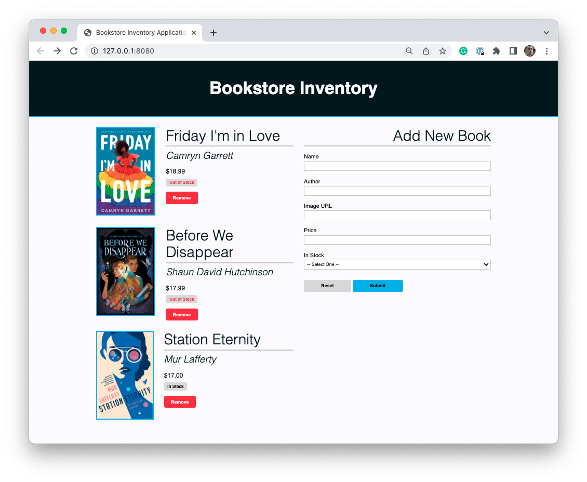

# Inventory Web Application Project

In this project, you will build a simple inventory management application for a single resource. That resource could be shoes, books, snacks, or anything else you are interested in. Through your application, you will be able to visually display a few resources, remove those resources, and create new resources. This project will require heavy DOM manipulation in addition to a solid understanding of HTML and CSS.

## Project Scoring

This project has two different parts on which you will be graded. Each part is weighted differently.

- 60% of the project is scored on **completion**.
- 30% of the project is scored through the **mastery rubric**.
- 10% of the project is scored through **stretch goals**.

In total, you must receive at least 70% to complete this project. For example, you could attain 50% of points through the completion requirements and 20% of points through the mastery rubric.

## Completion

### Set up

1. Create a GitHub repository.
1. Your GitHub repository should have a `README.md` file with setup instructions and a guide on how to run your application.

### Styling

3. The page should have a cohesive and professional style, that makes use of a few specific colors.
1. The page should make use of CSS Grid, and include at least two columns.
1. The page should have at least one responsive element on the page that changes depending on the screen's size.

### On Load Features

6. Users can see a header on the top of the page that includes a title for the web application.
1. Users can see three unique resources, that include the following fields and at least two others:
   - name
   - price
   - in stock
1. Users can see a "Remove" button associated with each resource.
1. Users can see a form that includes all fields for each resource, a "Submit" button, and a "Reset" button.

### Interactive Features

10. When a user clicks on the "Remove" button for each resource, that resource is removed from the page.
1. The user should have a way to update the "in stock" value for existing resources. An interaction should change the resource from being "in stock" to "out of stock," and vice versa.
1. The form should require at least three of the fields of the resource to be required. If the "Submit" button is clicked and those requirements are not met, an error message should be shown to the user telling them exactly what is wrong. The form fields should stay filled in and a resource should not be created.
1. When the "Reset" button is clicked, the form should be cleared.
1. When the form is completed correctly, the form should be cleared and a new resource should appear at the top of all previous resources.

### Mastery rubric

This section of the project is designed to measure your increasing skill at writing good code and following best practices.

To view components of the mastery rubric, view the appropriate assignment on Canvas.

### Stretch goals

This section of the project measures your ability to go above and beyond in creating your project. To score points in this section, you should incorporate a feature, technology, or skill not explicitly required by the project instructions.

When you submit your pull request, _make sure to include a description of any stretch goals you implemented._ You may choose from the list below or come up with features or tasks that are more relevant to your specific implementation of the project.

- When a resource is clicked, the element is expanded and more information is displayed.
- If a field is missing a value, provide a default value when a resource is created on the page.
- Allow for the ability to edit existing resources, by using the already existing form.
- Incorporate complex CSS properties like [transition effects](https://css-tricks.com/almanac/properties/t/transition/).
- Create a Footer that sticks to the bottom of the browser window even if all elements have been removed.

## Project setup and overview

There are no tests for this project and you _should not_ fork and clone this repository. Instead, create a new repository.

## Example

The following application chooses to use "books" as the main resource for this project.

Upon loading the page, three books (i.e., resources) can be seen with the required fields. The form is also visible. The page is styled professionally and makes use of CSS Grid.

If the screen size changes, the page responds. In this image, the form is moved below the resources on smaller screen sizes.

If the form is submitted, error messages appear saying exactly what is wrong. In the image above, We see that the name, author, price, and in stock fields must be set and must fit certain requirements.

If only some of the problems from the form are fixed, errors still occur. As you can see, however, there are fewer error messages.

When the form is submitted correctly, a new resource is created. In this case, a new book appears on the left side of the screen. The form is then cleared of all values. The "Remove" button will be able to remove this book.

In this example, clicking "In Stock" or "Out of Stock" will toggle the value for that book. Notice how the label is visually distinctive depending on the status of the book.
